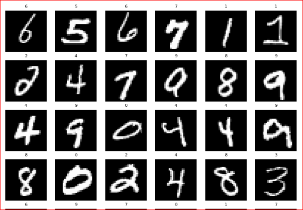
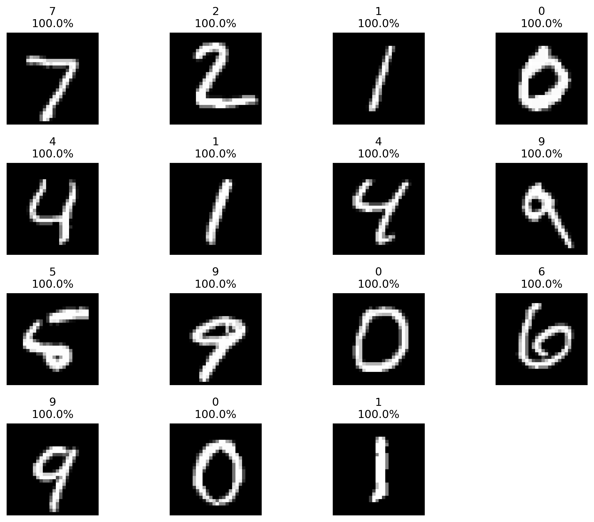
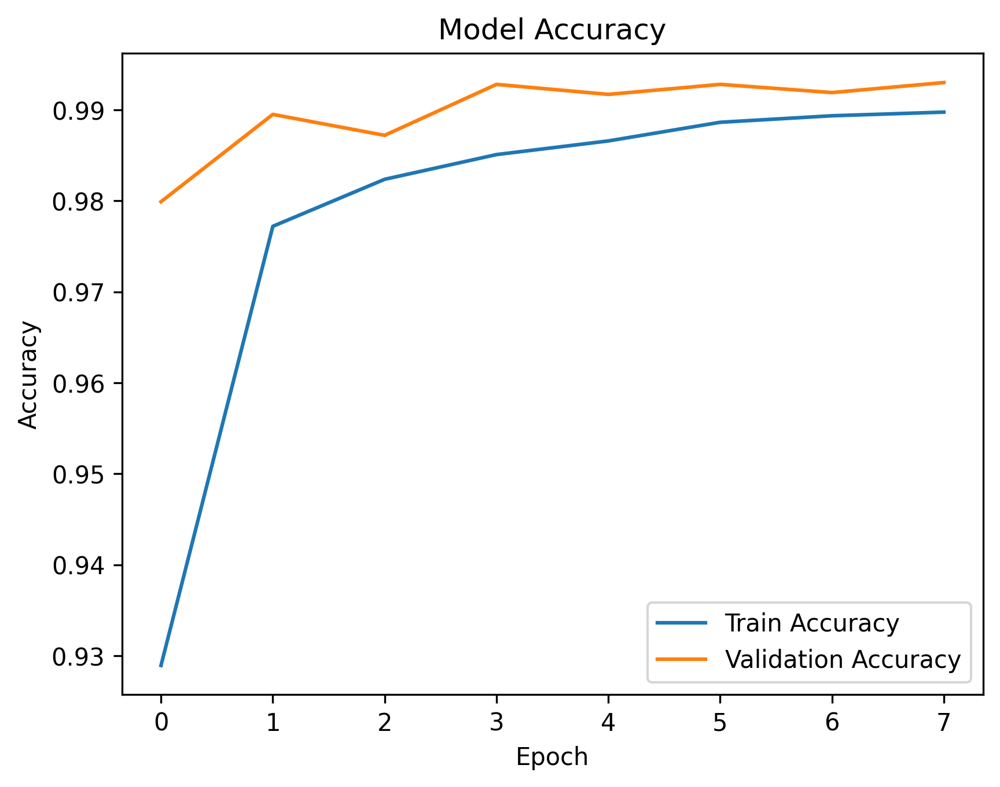
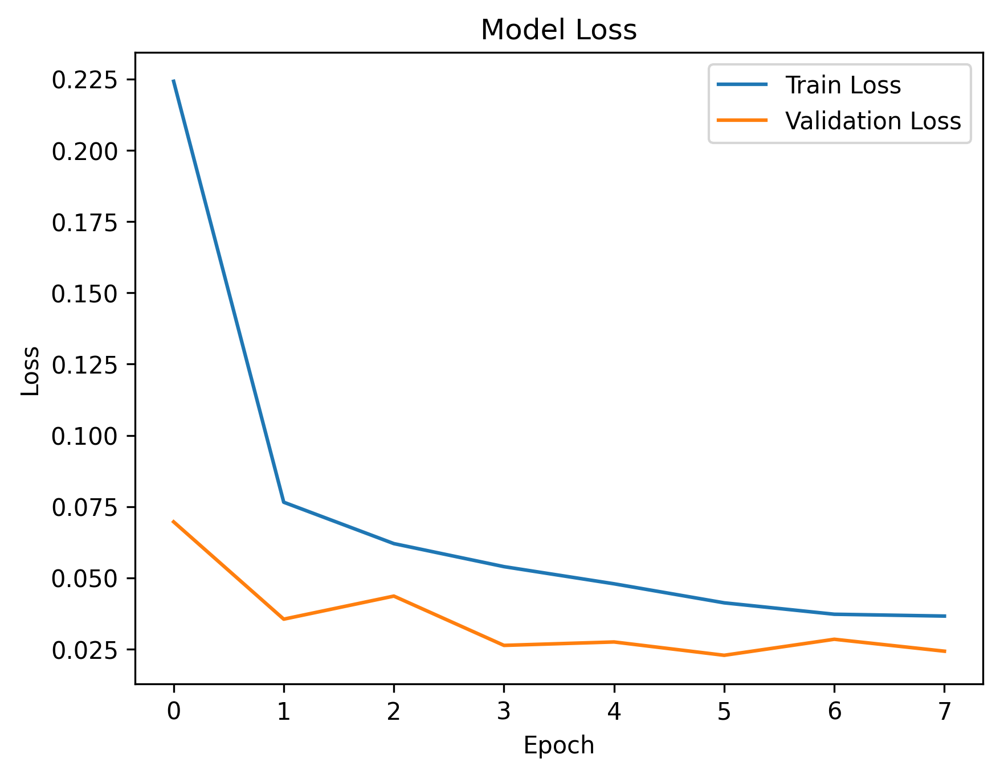
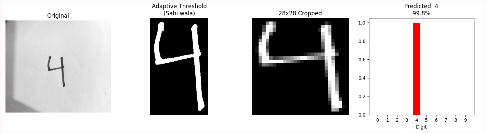

# Handwritten Digit Recognition using MNIST

A deep learning project that classifies handwritten digits (0–9) using the MNIST dataset. This project explores the dataset, trains a neural network, evaluates its performance, and tests predictions on handwritten digit images.

## Visualizations

### 1. MNIST Dataset Samples

Examples of handwritten digits from the dataset.

### 2. Predicted Digits

Examples of the model's predictions on digit images.

### 3. Training vs. Validation Accuracy

Comparison of training and validation accuracy across epochs.

### 4. Training vs. Validation Loss

Comparison of training and validation loss across epochs.

### 5. Custom Handwritten Digit Prediction

Testing the trained model on a user-provided handwritten digit image.

## Technologies Used

* Python
* Google Colab
* NumPy
* Matplotlib
* TensorFlow/Keras 

## Project Notebook

Explore the complete implementation in [`MNIST_Image_Recognition.ipynb`](MNIST_Image_Recognition.ipynb).
